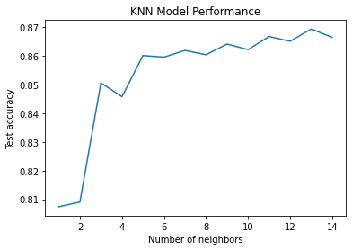

# Quantum-enhanced Support Vector Machines for Stellar Classification


Table of Contents

1. [Introduction](#introduction)
2. [Feature Engineering](#feature engineering)

## Introduction

This project aims to investigate the feasibility of employing quantum-enhanced support vector machines (QSVMs) for stellar classification based on spectral data from the open source dataset\cite{Ku_KaggleStellar}. The core of the study involves designing and implementing a novel QSVM algorithm, which will be compared to traditional SVMs and Morgan–Keenan (MK) classification system, that is conventionally used in the field of stellar classification. Furthermore, the project seeks to explore the potential GPU acceleration techniques for the task of QSVM model training. Ultimately, this study will attempt to demonstrate the potential of quantum computing in enhancing the precision and efficiency of machine-learning approaches in astronomy.

You can find our project proposal [here](./QHack_Project_Proposal_2023.pdf).

## Feature Engineering

In order to facilitate quantum kernel learning, classical pre-processing methods can be utilized to decrease the dimensionality of the data or extract pertinent features prior to quantum kernel training. This approach can decrease the computational load and enhance the model's accuracy by decreasing noise and uncertainty associated with the quantum data. A technique for preparing the data for quantum kernel learning is to convert the quantum state into a different representation that is more suitable for machine learning methods. This may involve applying quantum circuits or other transformations to the data to extract valuable features.

There are 6 attributes provided in the original dataset. We believe only 2 of them, `B-V` and `Amag`, are relevant to the classification. They represents the B-V color index and absolute magnitude of the star, respectively. In addition,  we defined 4 more composite attributes. They are:
```math
\begin{align}
		&\texttt{Amag\_SQ} = \texttt{Amag}^2\\
    &\texttt{B-V\_SQ} = \texttt{B-V}^2\\
    &\texttt{B-V+Amag} = \texttt{B-V} + \texttt{Amag}\\
    &\texttt{B-V-Amag} = \texttt{B-V} - \texttt{Amag}
\end{align}
```


A detailed analysis of the relationship between target classification and other features is necessary, and a figure providing a visual representation of this relationship is shown below. We can find that composite features play a critical role in successfully amplifying even small variations, leading to further separation of peaks in the data. This suggests that composite features can improve the accuracy of target classification, especially in challenging cases.


## Results

### Quantum Kernel Learning for Large Dataset

Our quantum kernel learning approach for star classification shows improved performance with increasing training data, surpassing the classical kernel in accuracy, f1 score, and specificity. The quantum kernel remains stable at around 0.9 in sensitivity, indicating its robustness. Our results suggest the superiority of the quantum kernel, which is more stable than the classical kernel, due to its ability to efficiently capture and process complex features.

<div align=center>
<div align=center>
<div align=center>
<div align=center>
  </p>


### GPU Acceleration with cuQuantum for Quantum Kernel Encoding

Quantum computing has potential in solving complex machine learning problems, but training quantum models is computationally intensive and requires specialized hardware. Quantum kernel learning, a technique that pre-processes data using classical hardware before training a quantum kernel, has shown promising results. CuQuantum is a software library that enables training of quantum models on NVIDIA GPUs, leading to faster and more accurate predictions. The speedup is due to the parallel processing power of GPUs, and using CuQuantum and CUDA also reduces computational cost, making quantum kernel learning more accessible and scalable.

The following figure shows the GPU speedup for kernel encoding by cuQuantum compared to CPU:


# Discussion

### Classical Model for Benchmarking with two-labelled classification

#### K-Nearest Neighbors (KNN)

KNN is a widely used non-parametric algorithm for classification and regression tasks, including star classification. It works by finding the K closest neighbors based on features such as magnitude, color, and distance, and assigning the class of the test star based on the most common class among the neighbors. However, the performance of KNN depends on the choice of K and distance metric, which can lead to overfitting or underfitting

 In the context of star classification, KNN has shown promising results due to its simplicity and interpretability. The performance of our KNN model on the large star dataset is shown below. Accuracy increases as K decreases, with the highest accuracy of 86.5% achieved when K = 15. We have selected K = 15 as the optimal parameter for star classification. However, the optimal value of K can vary depending on the dataset and classification problem. Nonetheless, KNN remains a simple and effective classification algorithm that can provide accurate result



#### Logistic Regression (LR)


### Classical Model for Benchmarking with multi-labelled classification


# Reference


